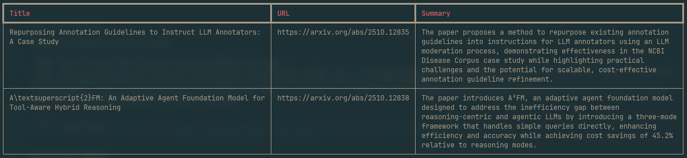

# Akaibu

Akaibu reads arXiv RSS feed and finds papers that match your requirements by using LLMs.


## Setup

### Install

```sh
uv tool install akabu
```


### Set your LLM provider

If you have ollama running on your machine, just do,

```sh
akaibu set-endpoint http://localhost:11434/v1 ollama
```

The first argument is the url for the LLM API endpoint, the second is the key. For local ollama, you don't need a key, so it can actually be anything.


### Create a feed

A feed is composed of three things,

- Name: Can be any string. This is just to identify the feed.
- URL: This is a URL for the arXiv RSS feed you want to subscribe. Check [this page](https://info.arxiv.org/help/rss.html) to know how it works. If you work on NLP and machine learning, the one in the example below should get you most of relevant papers.
- Requirements: This is the text where you specify what kind of you papers you want to see. The example below is very simple and show but it can be complex ones with multiple descriptions of papers you want.

```sh
akaibu create-feed "awesome-llms" "https://rss.arxiv.org/rss/cs.LG+cs.CL" "I want any papers about LLMs."
```

Can be more complex

```sh
akaibu create-feed "llm-agent-memory" "https://rss.arxiv.org/rss/cs.LG+cs.CL" "Papers that that explore the use of LLMs as Agents. Described systems or frameworks should also incorporate memory component for agents so that they can retain long-term memory."
```


## Use it

After setting up everything, finally, you can run the command to get the papers, simply run the following command

```sh
akaibu <number-of-papers-to-consider> <model-name> -l <library-name>
```

So, an example that corresponding the previous one would be something like,

```sh
akaibu 25 qwen3:4b -l awesome-llms
```

This will download 25 most recent papers from arXiv RSS feed, and filter the ones that match your requirements and present with a short summary.
The result would look like,



`akaibu` saves which papers have been scanned with an LLM, so you cannot have the same papers recommended.


## Road map

### It takes time to consume many papers

Currently all of the papers are checked by an LLM. If you are digesting many papers at once, this can take time. I am planning to pre-filter with a ligher model before LLM check.
